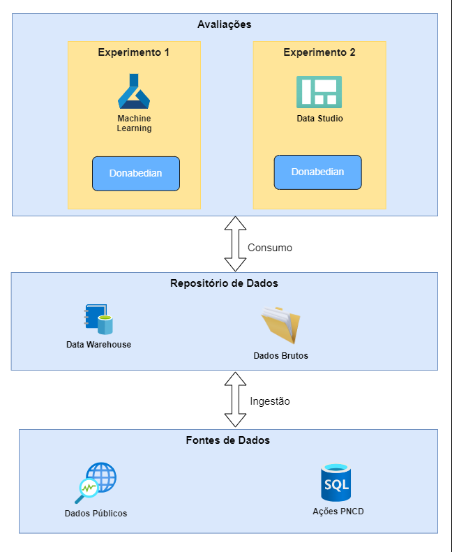

# Metodologia baseada em ciência de dados para avaliação do programa de combate à dengue
Códigos desenvolvidos durante a pesquisa de doutorado para avaliação do programa de combate à dengue.

## Informações Gerais

- Autor: Fernando Xavier
- Orientador: Antonio Mauro Saraiva
- Instituição: Escola Politécnica da Universidade de São Paulo
- Data da Defesa: 01/09/2023
- Texto completo: <a href="https://www.teses.usp.br/teses/disponiveis/3/3141/tde-09112023-115721/pt-br.php" target="_blank">Link da tese</a>
- Vídeo da defesa: <a href="https://www.youtube.com/watch?v=fsffpwU5sR0" target="_blank">YouTube</a>

## Dados do Estudo
- Período: 2015 - 2019
- Região: 645 municípios do estado de São Paulo
- Principais referenciais téoricos: [Donabedian](https://jamanetwork.com/journals/jama/article-abstract/374139), [Saúde Planetária](https://www.thelancet.com/journals/lancet/article/PIIS0140-6736(15)60901-1/fulltext)

## Dados Técnicos
- Linguagem de programação: Python
- Ambiente de desenvolvimento: Google Colab
- Armazenamento: Google Drive, MySQL, PostgreSQL, BigQuery

## Fontes de Dados

Categoria | Fonte | Acesso |
| ------ | ------- | ------- |
| Ações  | SUCEN   | Restrito |
| Clima  | WorldClim  | [Historical climate data](https://www.worldclim.org/data/worldclim21.html) |
| PIB  | IBGE   | [PIB Municípios](https://www.ibge.gov.br/estatisticas/downloads-estatisticas.html) |
| Investimentos  | SIOPS   | [Municípios/Série Histórica de Indicadores](https://www.gov.br/saude/pt-br/acesso-a-informacao/siops) |
| IDHM  | IPEA   | [Bases](https://www.ipea.gov.br/ipeageo/bases.html) |
| Casos  | DATASUS   | [SINAN](https://datasus.saude.gov.br/acesso-a-informacao/doencas-e-agravos-de-notificacao-de-2007-em-diante-sinan/) |
| Unidades Básicas de Saúde  | DATASUS   | [Estabelecimentos](https://datasus.saude.gov.br/cnes-estabelecimentos/) |
| Infestação  | SUCEN   | Restrito |
| Profissionais de Saúde  | DATASUS   | [CNES](https://datasus.saude.gov.br/cnes-recursos-humanos-a-partir-de-agosto-de-2007-ocupacoes-classificadas-pela-cbo-2002) |
| Uso do Solo  | MapBiomas   | [Estatísticas](https://brasil.mapbiomas.org/estatisticas/) |
| População Urbana  | SNIS   | [Informações e indicadores municipais consolidados](http://app4.mdr.gov.br/serieHistorica) |
| Água e Esgoto  | SNIS   | [Informações e indicadores municipais consolidados](http://app4.mdr.gov.br/serieHistorica) |

## Experimentos

### Experimento 1
Analiação dos componentes do modelo de Donabedian de acordo com o contexto.

### Experimento 2
Painel BI para monitoramento contínuo de indicadores baseados no modelo de Donabedian.

## Arquitetura da Solução

O ciclo de vida dos dados para esta pesquisa foi baseado em um processo ELT (extract-load-transform) que, no contexto de um Data Lake, inverte as etapas de carga e transformação de um tradicional processo de ETL (extract-transform-load). Assim, os dados são armazenados no seu estado original em um Data Lake e transformados de acordo com seus usos. 

A coleta foi realizada de fontes de dados públicas e privadas e armazenadas em um repositório. No contexto desta pesquisa, apenas para fins experimentais, o repositório dos dados brutos foi o Google Drive. Em seguida, já na etapa de transformação, os dados foram agregados em indicadores e armazenados em um Data Warehouse, para o qual foi utilizado o ambiente Google BigQuery.

Por fim, os dados foram consumidos pelos dois experimentos descritos anteriormente, com utilização de scripts Python (no Experimento 1) e da ferramenta Google Looker (para o Experimento 2). Para mais detalhes do processo, consultar a <a href="https://www.teses.usp.br/teses/disponiveis/3/3141/tde-09112023-115721/pt-br.php" target="_blank">tese</a>.

## Preparação antes de executar

### Se for usar o Google Colab
- Suba os arquivos desejados com a mesma estrutura de pastas (caso contrário, lembre-se de ajustar referências, caso necessário)
- Faça uma cópia do arquivo .env-template e renomeie-o como .env, indicando os valores das variáveis para o seu ambiente
- Crie um arquivo chamado caminho_env.txt na raiz do Google Drive e aponte para o caminho do arquivo .env criado

### Se não for usar o Google Colab
- Suba os arquivos desejados com a mesma estrutura de pastas (caso contrário, lembre-se de ajustar referências, caso necessário)
- Faça uma cópia do arquivo .env-template e renomeie-o como .env, indicando os valores das variáveis para o seu ambiente
- Crie um arquivo chamado caminho_env.txt na raiz do projeto e aponte para o caminho do arquivo .env criado
- Lembrar de remover as referências de conexão para o Google Drive 